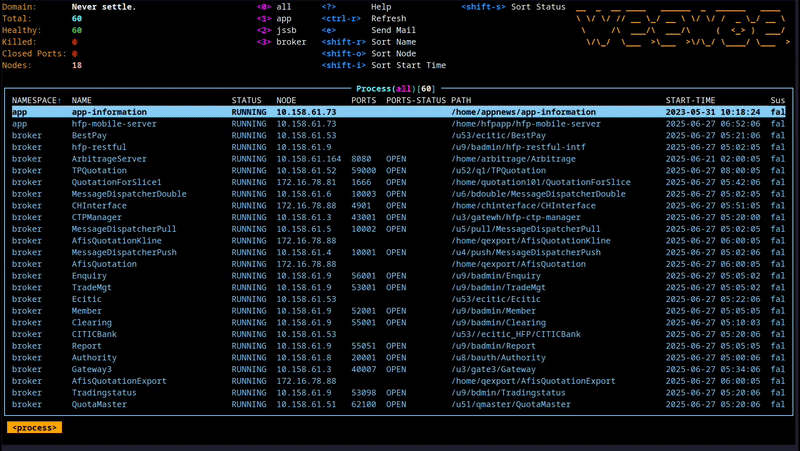

## weewoe

[](https://github.com/mum4k/termdash/blob/master/LICENSE)

**weewoe** borrows the terminal UI from [k9s](https://github.com/derailed/k9s), and is designed to monitor legacy software that does not support health probe interfaces. The backend service, **w2psd**, monitors background processes and ports via SSH, and sends alerts to **[Alertmanager](https://github.com/prometheus/alertmanager)** when processes crash or ports become unreachable. The command-line tool **w2ctl** communicates with **w2psd** using gRPC.

### Features:

1. Continuously monitors the liveness of processes and ports
2. Notifies Alertmanager when abnormal conditions are detected.
3. Periodically emails process status reports



---

## Note...

**weewoe** is not intended to be a full-featured system. Its main purpose is to provide a centralized view for probing legacy, non-cloud-native distributed services. Features supported by k9s such as log viewing, process control, or shell access are not included here.

---

## Config

```toml
[domain]
name = "Never settle."
[scrape]
# minute interval
interval = 5
[alert]
notify = true
ignore_time = ["05:00-07:00","08:00-08:40","23:40-23:59"]
url = "http://127.0.0.1:9093/api/v1/alerts"
[mail]
send = true
cron = "00 07 * * *"
server = "your.email.server"
port = 25
user = "your.email@domain"
passwd = ""
to = "warn.receiver@domain"
[report]
title = "a process state report in html"
reporter = "the reporter name"

## processes
[[data.processes]]
host = "192.168.1.9:22"

[[data.processes.process]]
osuser = "app"
name = "Report"
path = "/home/app/Report"
pidfile = "/home/app/Report/bin/com.report.ReportServer.pid"
ports = [55051]
group = "broker"
```

If the process does **not** support a PID file, you can use `ps -ef | grep flag` to match the process. Configure the `flag` carefully to ensure it uniquely identifies the target process:

```toml
[[data.processes.process]]
osuser = "jssb"
name = "solr"
path = "/home/app/solr-7.4.0"
ports = [8983]
flag = "solr.jetty.https.port=8983"
group = "jssb"
```

`w2psd` looks for a configuration file named `w2psd.toml` in the following locations, in order of precedence:

- /etc/weewoe/
- The current working directory `./`
- The `weewoe` directory under the user's home directory（`$HOME/weewoe/`）

## start|stop

```shell
# start
nohup /usr/local/bin/w2psd > check.log 2>&1 &

#stop
kill $(ps -ef | grep w2psd | grep -v grep | awk '{print $2}')
```

## run w2ctl

If `w2psd` is deployed locally, you can run `w2ctl` directly. Otherwise, specify the server IP with `w2ctl -s <w2psd IP>`.
